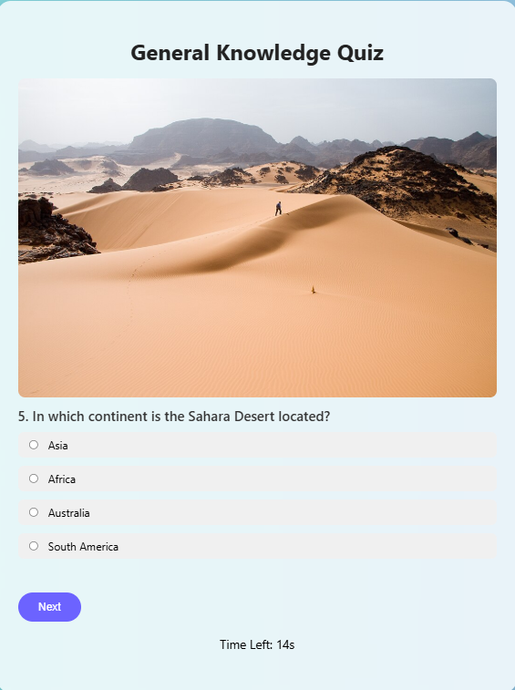
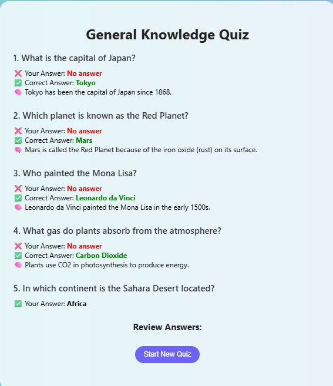

# 🧠 Interactive Quiz Application

An interactive quiz web app built with **HTML**, **CSS**, and **JavaScript**, featuring:
- One-question-at-a-time format
- A timer for each question
- Random question selection
- Images and explanations for learning
- Score tracking and review system


## 🚀 Features

- 🎲 **Randomized questions**: 5 questions selected from a pool of 10 on every quiz attempt
- 🕒 **15-second timer** per question
- 📸 **Image support** for visual engagement
- ✅ **Answer explanations** shown during review
- 🔁 **Restart quiz** without refreshing the page
- 🎯 **Score display** after completing all questions


## 🧪 How to Use

1. **Clone the repo**
   ```bash
   git clone https://github.com/yourusername/quiz-app.git
   cd quiz-app
2. Open index.html in your browser.
3. Play the quiz:
    - You’ll be shown 1 question at a time.
    - Answer before the 15s timer runs out.
    - After 5 questions, see your score and click:
    - Review Answers
    - Start New Quiz

  
## 🎨 Demo Screenshot





## 🛠 Built With
- HTML
- CSS (vanilla, no frameworks)
- JavaScript (DOM + logic)

# 📃 License
MIT

# ✍️ Author
Gunjan – Built with love for learning and leveling up.
